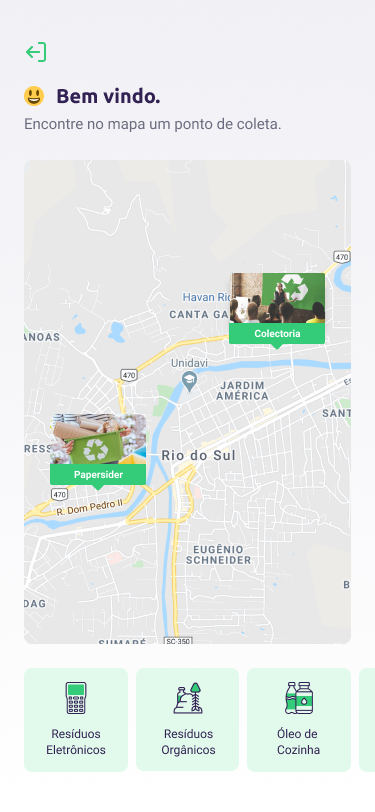

<h1 align="center">
    
</h1>

<h3 align="center"> 
	🚀 NextLevelWeek 1.0🚀
</h3>

<p align="center">
  

  <a href="https://www.linkedin.com/in/augusto-ostapechen/">
    
  </a>
  
  
</p>

# Índice

<p align="center">

[NLW](#nlw) -
[Sobre](#sobre) -
[Layout](#layout) -
[Documentação](#documentacao) -
[Tecnologias Utilizadas](#tecnologias-utilizadas) -
[Como rodar este projeto](#como-rodar) -
[Licença](#licenca)

</p>

<a id="nlw"></a>

## :information_source: O que é o Next Level Week?

O NLW é uma semana prática com muito código, desafios e networking onde aprendemos novas ferramentas, novas tecnologias e descobrimos hacks que nos ajudam a impulsionar nossas carreiras. Um evento online e totalmente gratuito.

<a id="sobre"></a>

## :bookmark: Sobre o projeto ♻️

O **Ecoleta** é um marketplace cujo objetivo é conectar empresas ou entidades de coleta de resíduos à pessoas que precisam descartar seus resíduos de maneira ecológica.

As empresas ou entidades poderão se cadastrar na plataforma web e as pessoas terão acesso ao aplicativo móvel, onde poderão navegar pelo mapa para ver as instituições cadastradas e encontrar um ponto de coleta mais próximo.

<a id="layout"></a>

## :art: Layout

O layout da aplicação está disponível no Figma:

<a href="https://www.figma.com/file/1SxgOMojOB2zYT0Mdk28lB/Ecoleta?node-id=136%3A546">
  
</a>

Lembrando que você irá precisar ter uma conta no [Figma](http://figma.com/).

### :iphone: Mobile

<p align="center">
  

  
</p>

### :desktop_computer: Web

<p align="center">
  
</p>

<a id="documentacao"></a>

## :books: Documentação

Para reforçar alguns conceitos e registrar comandos que são difíceis de se lembrar existe uma pequena **[DOCUMENTAÇÃO](Conceitos.md)** para ajudar quem esta iniciando com **TypeScript**, **Node**, **ReactJS** e **React Native**.

<a id="tecnologias-utilizadas"></a>

## :rocket: Tecnologias Utilizadas

O projeto foi desenvolvido utilizando as seguintes tecnologias

- [Node.js](https://nodejs.org/en/)
- [ReactJS](https://reactjs.org/)
- [React Native](https://reactnative.dev/)
- [Expo](https://expo.io/)

<a id="como-rodar"></a>

## :rocket: Como rodar este projeto

Podemos considerar este projeto como sendo divido em três partes:

1. Back End (pasta server)
2. Front End (pasta web)
3. Mobile (pasta mobile)

:bulb: Tanto o Front End quanto o Mobile precisam que o Back End esteja sendo executado para funcionar.

- ### **Pré-requisitos**

Antes de começar, você vai precisar ter instalado em sua máquina as seguintes ferramentas:
- **[Git](https://git-scm.com)**
- **[Node.js](https://nodejs.org/en/)**
- **[Expo](https://expo.io/)**

Além disto é bom ter um editor para trabalhar com o código. Neste projeto foi usado o [VSCode](https://code.visualstudio.com/)

- ### Baixando o projeto

```bash
# Clone este repositório
$ git clone https://github.com/augustoost/Next-Level-Week01.git

```

- ### :gear: Rodando o Back End (servidor)

```bash
# Acesse a pasta do projeto no terminal
$ cd Next-Level-Week01

# Vá para a pasta server
$ cd server

# Instale as dependências
$ yarn

# Crie o banco de dados
$ yarn run knex:migrate
$ yarn run knex:seed

# Execute a aplicação em modo de desenvolvimento
$ yarn dev

# O servidor inciará na porta:3333
```

- ### :world_map: Rodando a aplicação web (Front End)

```bash
# Acesse a pasta do projeto no seu terminal
$ cd Next-Level-Week01

# Vá para a pasta da aplicação Front End
$ cd web

# Instale as dependências
$ yarn

# Execute a aplicação em modo de desenvolvimento
$ yarn start

# A aplicação será aberta na porta:3000 - acesse http://localhost:3000
```

- ### :iphone: Rodando a aplicação mobile

```bash
# Acesse a pasta do projeto no seu terminal
$ cd Next-Level-Week01

# Vá para a pasta da aplicação Mobile
$ cd mobile

# Instale as dependências
$ yarn

# Execute o app em modo de desenvolvimento
$ yarn start

# Usando o Expo, basta digitalizar o qrcode no terminal ou na página da exposição

# Se houver algum problema com as fontes, execute:
$ expo install expo-font @expo-google-fonts/ubuntu @expo-google-fonts/roboto
```

<a id="licenca"></a>

## :memo: Licença

Esse projeto está sob a licença MIT. Veja o arquivo [LICENSE](LICENSE) para mais detalhes.
